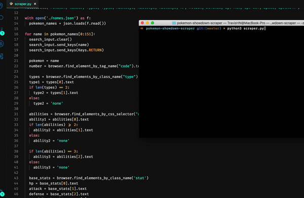

# Pokemon Showdown Webscraper

## Overview
A simple script that grants direct access to basic data on Generation 1 to 7 Pokemon through Selenium web scraping. Data is generated and organized into CSV files, which can be then used in various ways such as creation of a database for use on a personal project.


## Getting Started
First install the necessary packages in your terminal:
```
$ pip install -r req.txt
```
Simply run the script via "python scraper.py" and watch Selenium scrape data from Pokemon Showdown for you!
```
$ python scraper.py
```


## Note
You can dictate which generation of pokemon data you are scraping by altering the numbers on line 15 of the scraper script. This simply slices out the names of the pokemon_names data array.

```python
for name in pokemon_names[721:807]:
```
```python
Generation All  : [0:1068]
Generation 1    : [0:187]
Generation 2    : [187:293]
Generation 3    : [293:430]
Generation 4    : [430:537]
Generation 5    : [537:703]
Generation 6    : [703:778]
Generation 7    : [778:867]
Generation 8    : [867:963]
Generation 9    : [963:1068]
```
If you decide to separate the data by Pokemon Generation, be sure to change the path that the file is opening on line 9 accordingly. For instance, if you are scraping for Generation 4:

```python
file = open("./pokemon-data/pokemon-gen4-data.csv", 'w')
```
